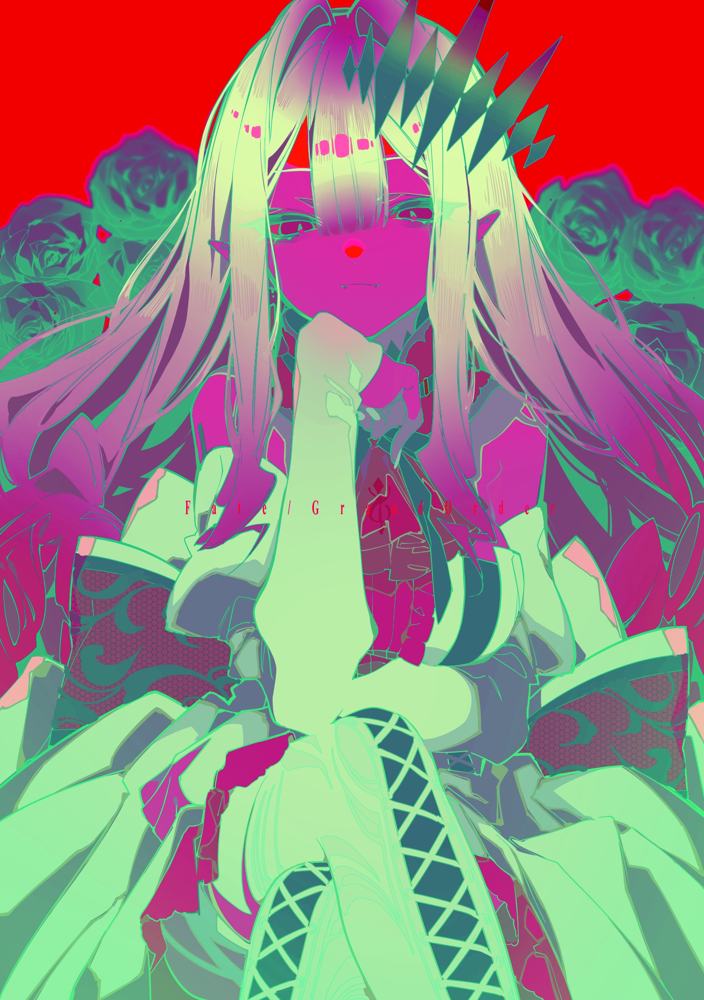

# Task02
# OpenCV 图像处理

## 概述

本项目使用 OpenCV 实现了多种图像处理操作，并将处理结果保存到 `assets` 目录中。以下是项目涉及的主要操作和对应的输出文件。

## 项目结构

```
.
├── CMakeLists.txt         # CMake 构建配置
├── README.md              # 项目说明文档
├── assets/                # 包含所有输出文件
│   ├── blurred_image.jpg      # 高斯模糊后的图像
│   ├── contour_areas.log      # 轮廓区域面积的日志
│   ├── contour_image.jpg      # 红色区域的轮廓和边界框
│   ├── cropped_image.jpg      # 裁剪后的图像
│   ├── drawn__image.jpg  # 参考配色绘制的图像
│   ├── processed_image.jpg       # 膨胀和腐蚀后的图像
│   ├── gray_image.jpg         # 灰度图
│   ├── hsv_image.jpg          # 转换为 HSV 的图像
│   ├── red_mask.jpg           # 提取红色区域的掩码
│   └── rotated_image.jpg      # 旋转后的图像
├── build/                 # 构建目录(忽略)
├── resources/
│   └── test_image.png     # 输入图像
└── src/
    └── main.cpp           # 图像处理代码
```

# Task02
# OpenCV 图像处理

## 概述
本项目通过 OpenCV 实现了多种图像处理操作，并将所有结果图像保存到 `assets` 目录。以下为项目处理的各个步骤及其对应的输出文件：

## 实验结果

### 1. 图像颜色空间转换
- **转化为灰度图**  
  将输入图像从 RGB 转换为灰度图。  
  **输出:** 

- **转化为 HSV 图像**  
  将输入图像从 RGB 转换为 HSV 图像。  
  **输出:** 

### 2. 应用各种滤波操作
- **应用均值滤波**  
  对图像应用均值滤波，进行简单的平滑处理。  
  **输出:** 

- **应用高斯滤波**  
  对图像应用高斯模糊，进行更高级的平滑处理。  
  **输出:** 

### 3. 特征提取
- **提取红色颜色区域 (HSV 方法)**  
  使用 HSV 颜色空间的范围定义提取图像中的红色区域。  
  **输出:** 

- **寻找图像中红色的外轮廓和边界框**  
  对红色掩码进行轮廓检测，提取图像中的红色外轮廓和边界框。  
  **输出:** 

- **计算轮廓的面积**  
  计算红色区域的轮廓面积，并记录在 `contour_areas.log` 中。  
  **输出日志文件:** [contour_areas.log](assets/contour_areas.log)
  

### 4. 提取高亮颜色区域并进行图形学处理
- **二值化**  
  对灰度图像进行阈值化处理，将其转换为二值图像。  
  **输出:** 

- **膨胀和腐蚀**  
  对二值化图像进行膨胀和腐蚀操作。  
  **输出:** 

- **漫水处理**  
  对经过处理的图像进行漫水填充。  
  **输出:** 

### 5. 图像绘制
- **绘制任意圆形、方形和文字**  
  在图像上绘制圆形、方形和文字。  
  **输出:** 

### 6. 图像处理
- **图像旋转 35 度**  
  将图像逆时针旋转 35 度。  
  **输出:** 

- **图像裁剪为左上角 1/4 区域**  
  将原图裁剪为左上角的 1/4 区域。  
  **输出:** 

## 实验过程

1. **目标**  
   利用 OpenCV 进行图像处理操作，包括灰度转换、HSV 转换、颜色提取、轮廓检测、模糊处理、旋转、裁剪等，并将结果保存为图像和日志。

2. **流程**  
   - 加载输入图像。
   - 依次进行各种处理操作，并保存处理结果。
   - 处理结果保存在 `assets` 目录，轮廓面积记录在 `contour_areas.log` 中。

3. **CMake 构建**  
   - 使用 CMake 构建项目。
   - 构建命令：
     ```bash
     mkdir build && cd build
     cmake ..
     make
     ```
 4. **一些心得**
      - 使用.gitignore可以忽略掉一些不必要的文件，比如build文件夹、.vscode文件夹等。

      - 对之前不太熟悉的文件系统操作，可以通过查阅OpenCV官方文档，或者直接在VS Code中使用IntelliSense来查看函数的参数和返回值，来快速了解函数的用法。

      - 对于新手，更简单的是，通过VS Code的CMake工具，你甚至可以在GUI界面中直接点击“Configure”和“Build”按钮来完成构建（注意build文件的默认位置在上一级文件夹）。
      
      - 使用VS Code编辑main.cpp时，其IntelliSense可能会出现问题——显示错误波形曲线并且提示找不到头文件。可以通过编辑`.vscode/c_cpp_properties.json`文件，添加头文件路径，来解决这个问题。