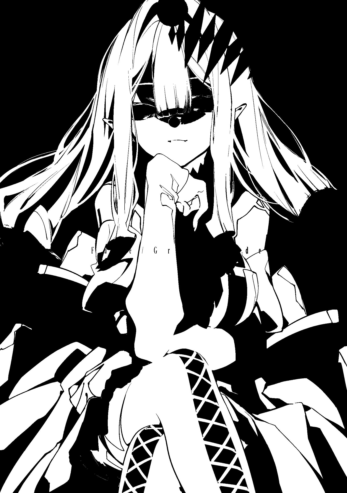
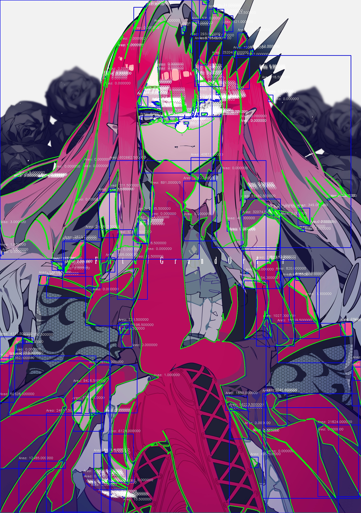

# Task02
# OpenCV图像处理

## 概述

本项目使用 OpenCV 实现了各种图像处理技术，并将所有处理结果保存在 `assets` 目录中。以下是项目中涉及的图像处理操作和对应的输出文件。

## 项目结构

```
.
├── CMakeLists.txt         # CMake 构建配置
├── README.md              # 项目说明文档
├── assets/                # 包含所有输出文件
│   ├── blurred_image.jpg     # 应用高斯模糊的图像
│   ├── contour_areas.log     # 轮廓区域面积的日志文件
│   ├── contour_image.jpg     # 红色区域的轮廓和边界框
│   ├── cropped_image.jpg     # 裁剪后的图像
│   ├── drawn_image.jpg       # 绘制了圆形、矩形和文本的图像
│   ├── eroded_image.jpg      # 经过膨胀和腐蚀操作后的图像
│   ├── gray_image.jpg        # 转换为灰度的图像
│   ├── hsv_image.jpg         # 转换为 HSV 的图像
│   ├── red_mask.jpg          # 提取红色区域后的掩码
│   └── rotated_image.jpg     # 旋转 35 度后的图像
├── build/                 # 构建目录(忽略)
├── resources/
│   └── test_image.png     # 输入图像
└── src/
    └── main.cpp           # 主要的图像处理代码
```

## 实验内容与结果

1. **灰度转换**  
   将输入图像转换为灰度图像。  
   **输出:** 

2. **转换为 HSV**  
   将输入图像从 BGR 颜色空间转换为 HSV 颜色空间。  
   **输出:** 

3. **提取红色区域**  
   从 HSV 图像中提取红色区域。  
   **输出:** 

4. **轮廓检测与边界框**  
   检测红色区域轮廓，并在图像中绘制轮廓和边界框。轮廓面积记录在 `contour_areas.log`。  
   **输出:** 
   
   截取部分log如下：
    ```log
    Contour 0 Area: 0
    Contour 1 Area: 4834.5
    Contour 2 Area: 1272
    Contour 3 Area: 0
    Contour 4 Area: 2557
    Contour 5 Area: 643
    Contour 6 Area: 0
    Contour 7 Area: 0
    ...
    ```
    完整的log文件请查看[contour_areas.log](assets/contour_areas.log)。

5. **高斯模糊处理**  
   对图像应用高斯模糊，进行平滑处理。  
   **输出:** 

6. **膨胀与腐蚀**  
   对红色掩膜进行膨胀操作，再进行腐蚀操作。  
   **输出:** 

7. **图像旋转**  
   将图像旋转 35 度。  
   **输出:** 

8. **裁剪图像**  
   裁剪图像左上角的四分之一区域。  
   **输出:** 

9. **绘制图形与文本**  
   在图像上绘制圆形、矩形，并添加文本。  
   **输出:** 
